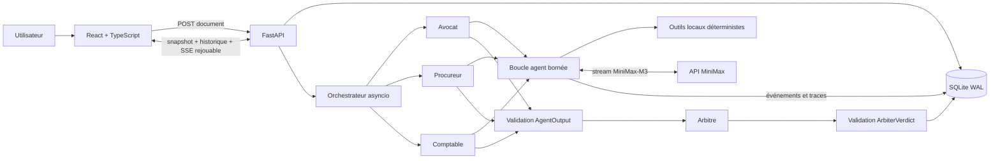

# CONCLAVE v1.0 — trois lectures contradictoires, un verdict exploitable

Dès l'ouverture, le front affiche le stepper et les **trois switches d'outils**
(indépendants, persistants, chargés automatiquement). Le document est ensuite
soumis (`POST /api/analyses`, statut `queued`, configuration des outils figée
dans la même requête) ; trois experts (**Avocat**, **Procureur**, **Comptable**)
l'analysent en parallèle une fois le flux SSE ouvert (`POST …/start`, appelé par
le front après `EventSource.onopen`, jamais avant), puis un **Arbitre** rend un
verdict. L'interface parcourt six étapes — **Soumettre, Convoquer, Observer,
Comparer, Arbitrer, Décider** — pilotées par les événements SSE observés (pas
par le seul statut du snapshot), et survit à un rechargement de page : le
snapshot et l'historique JSON paginé (`GET …/events/history`) sont chargés en
parallèle, et le flux SSE ne rouvre jamais depuis zéro ni pour une analyse déjà
terminale.

- **Front** : React 18 + TypeScript + Vite dans `frontend/`.
- **Back** : FastAPI + Python, SQLite et MiniMax-M3 dans `backend/`.
- **Livraison** : [`JOURNAL.md`](JOURNAL.md) documente les usages et refus de
  l'IA ; [`DEMO.md`](DEMO.md) contient le parcours de soutenance minuté.

## Prérequis

- Node.js ≥ 18 et npm.
- Python ≥ 3.10.
- Deux terminaux : un pour le backend, un pour le frontend.

## Démarrage en moins de cinq minutes

```bash
git clone https://github.com/Rwanbt/Holbertonschool-conclave.git
cd Holbertonschool-conclave
git checkout v1.0
```

### 1. Configuration locale

Copiez le fichier d'exemple à la racine vers `.env` (le fichier `.env` est
ignoré par git ; c'est lui qui porte la clé MiniMax, jamais commitée) :

```bash
cp .env.example .env
```

Ensuite, ouvrez `.env` et remplacez
`MINIMAX_API_KEY=replace_with_your_minimax_api_key` par votre clé MiniMax.
Pour activer les estimations de coût du Comptable, renseignez aussi
`MINIMAX_INPUT_USD_PER_MILLION` et `MINIMAX_OUTPUT_USD_PER_MILLION` (0.0 ou
absent = coût non revendiqué).

L'absence de tarifs ne bloque jamais une analyse : l'outil renvoie alors un
coût `null` avec `pricing_configured=false`. Quand ils sont présents,
l'estimation couvre les budgets agrégés des experts, de l'Arbitre, des tours
et des réparations configurées ; elle reste une borne estimative, pas une
facture fournisseur.

Options du front, dans `frontend/.env` (facultatif — la valeur par défaut
suffit au parcours local) :

```bash
cp frontend/.env.example frontend/.env
```

`VITE_API_BASE_URL` vaut `http://localhost:8000` par défaut. Cette variable
n'est pas secrète.

### 2. Terminal 1 — Backend

```bash
python -m venv .venv
source .venv/bin/activate          # Windows : .venv\Scripts\activate
pip install -r backend/requirements.txt
uvicorn backend.app.main:app --host 127.0.0.1 --port 8000 --reload
```

Le backend écoute sur `http://localhost:8000`. Vérification de santé :

```bash
curl -s http://localhost:8000/api/health
# -> {"status":"ok"}
```

### 3. Terminal 2 — Frontend

```bash
cd frontend
npm ci
npm run dev
```

Puis ouvrez **http://localhost:5173**.

## Architecture



Le navigateur ne dialogue jamais directement avec MiniMax. FastAPI valide le
document, fige la configuration d'outils, démarre les trois experts en
parallèle et persiste chaque transition avant sa diffusion SSE. Les outils
lisent le document conservé côté serveur et ne prennent aucun argument. Les
sorties des experts sont validées avant d'atteindre l'Arbitre ; le verdict est
à son tour validé avant affichage. SQLite est donc à la fois le snapshot
durable et la source du rejeu après un rechargement de page.

Le diagramme éditable complet se trouve dans [`architecture.mmd`](architecture.mmd).
Les prompts, signatures et boucles sont reproduits dans
[`AGENTS.md`](AGENTS.md), sans exiger la lecture du code.

## Choix techniques et alternatives écartées

| Choix retenu | Alternative écartée | Pourquoi |
| --- | --- | --- |
| SSE persisté et rejouable | WebSocket ou animation « machine à écrire » | Le flux est uniquement serveur → navigateur. SSE gère nativement la reconnexion ; persister les deltas prouve qu'ils viennent du fournisseur et permet F5 sans faux streaming. |
| SQLite en mode WAL | État en RAM, Redis ou PostgreSQL | L'état en RAM perdait les analyses au redémarrage. Redis/PostgreSQL auraient ajouté une infrastructure disproportionnée pour une démonstration mono-instance ; SQLite apporte transactions et durabilité locale. |
| Outils locaux sans argument | Envoyer le document dans les arguments d'outil | Le modèle choisit l'outil, mais ne peut ni changer le document analysé ni injecter un chemin, une commande ou un secret. |
| Pydantic + normalisation JSON isolée | Faire confiance au texte du modèle ou au seul `response_format` | MiniMax peut fermer le flux sans JSON valide. Une réparation bornée, sans outil et à température zéro, empêche une sortie invalide d'alimenter l'Arbitre. |
| SDK OpenAI-compatible direct | Framework agentique généraliste | Trois outils et quatre rôles ne justifient pas une couche d'abstraction supplémentaire ; la boucle, les limites et les événements restent auditables. |
| Validateurs TypeScript à l'exécution | Casts TypeScript sur les réponses HTTP/SSE | Les types disparaissent au runtime. Une réponse malformée est rejetée explicitement au lieu de corrompre silencieusement l'interface. |

Ces choix optimisent une livraison démontrable et inspectable, pas une montée en
charge mondiale. Les compromis qui en découlent sont listés explicitement plus
bas.

## Utiliser le Contrat Conclave

- **Soumettre** : collez un document (1 à 12 000 caractères, compteur affiché)
  puis cliquez « Convoquer le Conclave ».
- **Observer / Comparer** : chaque expert travaille dans une colonne dédiée ;
  sa réponse est visible **au fil de l’eau** pendant la génération, puis la
  carte structurée validée (constats, note et recommandations) la remplace dès
  qu’elle est prête.
- **Arbitrer / Décider** : l'arbitre écrit son verdict en direct avant la
  clôture ; la décision validée (`go`, `go_with_conditions` ou `no_go`), le
  score, les désaccords, les risques, les actions et le compromis accepté
  s’affichent dès que `verdict` est présent dans le snapshot.

### Streaming natif MiniMax — pas une simulation

Le backend transmet à MiniMax les **deltas réels** de la réponse via des
événements SSE persistés dans SQLite :

- `agent.response.started` — le rôle commence à écrire ;
- `agent.response.delta` — fragment de texte borné (`sequence` strictement
  croissante par rôle, `delta` borné par `STREAM_DELTA_BATCH_CHARS`) ;
- `agent.response.completed` — la réponse du rôle est terminée ;
- `agent.response.failed` — la réponse s’est arrêtée (ex. erreur de protocole).
- `analysis.started`, `agent.round.started` et `agent.round.completed` — le
  démarrage et la progression bornée de chaque tour sont persistés.

Le front reconstruit par rôle (`collectLiveResponses`) un **brouillon live** :
les deltas sont concaténés dans l’ordre des séquences, une séquence dupliquée
ne duplique jamais le texte, et les trois experts (et l’Arbitre) restent
séparés même si leurs événements sont intercalés. **Aucun timer, aucune
animation de révélation** : le texte affiché est exactement la concaténation
des deltas SSE validés. Un brouillon terminé n’est **jamais** une sortie
validée : seule la carte Pydantic du snapshot fait foi après `expert.completed`
ou `arbiter.completed`.

**Panneau démonstration** : une section « Flux des réponses » montre par rôle le
nombre de deltas reçus, le nombre de caractères, les séquences première et
dernière et le statut, ainsi qu’une timeline ordonnée où chaque `tool.*` côtoie
les `agent.response.*` — la preuve que les deltas arrivent avant la clôture,
jamais rejoués après coup. Le panneau n’affiche ni le JSON final brut, ni le
reasoning du modèle.

### Cycle de vie d'une analyse : queued → running → terminal

`POST /api/analyses` crée l'analyse en `queued` et fige, dans la même
requête, une copie immuable du registre d'outils (`analysis_tool_states`) :
une modification ultérieure du registre global (via les switches, pour la
*prochaine* analyse) n'affecte jamais celle-ci. Le job ne démarre pas à la
création : le front affiche l'analyse `queued`, ouvre `EventSource(?after=0)`,
attend `onopen`, puis appelle `POST /api/analyses/{id}/start` — idempotent
(compare-and-set SQL `queued → running`, 202 la première fois, 200
`already_started` ensuite), qui insère `analysis.started` avant tout
`expert.started`. Un outil désactivé dans la configuration figée n'est même
pas proposé à MiniMax (`tools` filtré, ou omis si aucun outil actif).

### Persistance et rechargement (F5)

L'UUID de l'analyse est stocké dans `localStorage` (clé
`conclave.currentAnalysisId.v1`) et dans l'URL (`?uuid=`). Au montage, le front
charge en parallèle le snapshot (`GET /api/analyses/{id}`) et l'historique JSON
paginé (`GET …/events/history?after=0&limit=500`, paginé tant que `has_more`)
pour reconstruire brouillons et traces sans rejouer `after=0` sur le flux SSE
vivant. Le flux SSE **n'est jamais rouvert** pour une analyse déjà terminale
(le front affiche l'état final directement, ce n'est pas une animation à
rejouer) ; pour une analyse `queued`/`running`, il reprend depuis le plus grand
identifiant hydraté. `POST …/start` part après `onopen` (ou après un délai de
secours) et dispose de trois tentatives bornées ; l'idempotence serveur évite
tout double job si la réponse HTTP s'est perdue. L'idempotence par `event.id`
absorbe les rejeux. `EventSource` tente sa reconnexion avec `Last-Event-ID`,
mais le front coupe après dix secondes sans reprise et affiche un bouton
« Réessayer la connexion » au lieu d'un spinner infini. Le POST de création
n'est jamais relancé au rechargement ; une analyse introuvable (404) nettoie
la référence locale.

### Panneau outils — switches indépendants dès la première page

Les trois switches (**Mesurer le document**, **Rechercher les indicateurs de
sécurité**, **Estimer le coût de l'analyse**) sont visibles et pilotables
avant même de coller un document, sans manipulation initiale : le catalogue
(`GET /api/tools`) est chargé automatiquement, et chaque switch
(`role="switch"`, `aria-checked`, état textuel Activé/Désactivé/Modification…)
envoie directement `POST /api/tool-commands` — un seul changement à la fois,
les autres restent verrouillés pendant la mutation, et une erreur conserve
l'état précédent sans jamais être écrasée par une réponse réseau obsolète
(compteur de requêtes monotone). `estimate_current_analysis_cost` affiche sa
dépendance à `measure_current_document` (« Nécessite Mesurer le document ») :
activé seul, il renvoie proprement `missing_prerequisite` sans jamais mesurer
implicitement. Pendant une analyse `queued`/`running`, le panneau bascule en
lecture seule sur la configuration **figée** de cette analyse ; après
« Nouvelle analyse », il recharge le registre global pour la suivante. Une
section « Commande avancée » repliable garde l'accès à la grammaire brute
(`/tools`, `/tools list`, `/tools enable <nom>`, `/tools disable <nom>`).

## Comportements hors du contrat

Les garde-fous du Palier 4 s'appliquent : aucune valeur inventée, un seul
outil par tour, sorties validées avant affichage, événements SSE bornés. Une
chute du flux SSE déclenche une reconnexion bornée puis une erreur actionnable ;
un événement malformé est ignoré et signalé sans vider le snapshot. Le document
de référence [`Happy_path.md`](Happy_path.md) doit parcourir les six étapes et
atteindre un état terminal avec un verdict validé ; la décision précise reste
une sortie du modèle et n'est volontairement pas codée en dur.

## Fiabilité, sécurité et explicabilité

### Répondre à « pourquoi l'agent a fait ça ? » sans ouvrir le code

Le panneau **« Pourquoi ce résultat ? »** s'affiche sous le verdict et donne,
dans l'ordre :

1. **ce qui a échoué** — chaque code d'erreur traduit en français avec l'action
   corrective (`provider_unavailable` → « MiniMax n'a pas répondu […] vérifiez
   MINIMAX_API_KEY ») ;
2. **le contrôle du document soumis** — tournures d'instruction repérées ;
3. **les outils disponibles pour cette analyse** — activés, et désactivés dont
   le schéma n'a pas été envoyé au modèle ;
4. **la décision prise à chaque tour** — par rôle : `a demandé un outil`,
   `a rendu sa réponse finale`, avec la latence ;
5. **les outils réellement exécutés** et leur résultat.

### Échouer bruyamment, jamais mentir

Deux issues acceptables quand on casse l'application : ça marche, ou ça refuse
proprement. Jamais « ça ment ».

| Entrée hostile | Réponse |
|---|---|
| Champ vide | 422, aucune analyse créée |
| Corps de 40 Mo | 413 sur `Content-Length`, ou dès que le flux sans longueur fiable dépasse 1 Mo |
| Émojis, cyrillique, SQL | acceptés, stockés à l'identique, requêtes paramétrées |
| Injection de prompt | analysée, **signalée**, sans extension de capacités (voir `SECURITY.md`) |
| Dix clics sur « Convoquer » | 429 au-delà de `MAX_CONCURRENT_ANALYSES`, avec la marche à suivre |
| Réseau coupé / fausse clé | `provider_unavailable` affiché, experts sortis de `running`, **aucun spinner infini** |

### Évaluation chiffrée

Cinq cas décrits à la main dans [`eval/cases.md`](eval/cases.md), rejouables en
une commande, **sans clé MiniMax** (le fournisseur est simulé) :

```bash
make eval          # ou, depuis frontend/ : npm run eval
```

Score courant : **5/5 invariants techniques avec fournisseur simulé** (2/5
avant le palier 5 — le détail et les limites de ce score sont dans
`eval/cases.md`). La CI exécute l'éval à chaque PR, donc une régression casse
le build.

### Sécurité

[`SECURITY.md`](SECURITY.md) répond en détail à « que se passe-t-il si
l'utilisateur écrit *ignore tes instructions précédentes* ? », et explique
pourquoi la détection heuristique n'est **pas** la défense — les vraies
barrières sont structurelles.

```bash
cd frontend && npm run build && cd ..
./scripts/check-no-secrets.sh     # aucune clé dans le bundle publié
```

### Thème clair / sombre

Un bouton dans l'en-tête bascule le thème. Par défaut l'application suit
`prefers-color-scheme` ; un choix explicite est mémorisé et l'emporte ensuite
sur le réglage système. Toutes les couleurs passent par des jetons CSS
(`src/index.css`), aucune valeur n'est codée en dur dans les composants.

## Procédure de test

```bash
cd frontend
npm ci
npm test -- --run
npm run lint
npm run build
```

Depuis la racine :

```bash
.venv/bin/python -m pytest backend/tests -q   # 166 tests + 1 smoke réel opt-in
.venv/bin/python eval/run_eval.py             # score attendu : 5/5
git status --short
git diff --check
```

Le workflow CI (`.github/workflows/ci.yml`) exécute ces mêmes commandes sur
chaque PR et push vers `main`/`dev`, sans clé MiniMax (le smoke test réel
`backend/tests/test_minimax_smoke.py` s'auto-`skip` sans `MINIMAX_API_KEY`).

État validé pour `v1.0` : **166 tests backend réussis, 1 smoke réel ignoré
sans clé, 101 tests frontend réussis, évaluation 5/5, lint et build réussis**.

## Limites connues et assumées

- **Une seule instance applicative.** SQLite WAL convient à la démo et à une
  petite charge, mais pas à plusieurs processus répartis. Avec cent
  utilisateurs, la limite `MAX_CONCURRENT_ANALYSES=3`, le débit MiniMax puis
  le polling SSE/SQLite seraient les premiers goulots. Une file durable et
  PostgreSQL/Redis seraient nécessaires avant une ouverture publique.
- **Tâches de fond dans le processus FastAPI.** Un redémarrage marque les runs
  actifs `interrupted` et préserve leurs événements, mais ne reprend pas leur
  calcul. Il faudrait un worker durable avec reprise idempotente.
- **Pas d'authentification ni de cloisonnement utilisateur.** L'UUID limite
  l'énumération accidentelle, mais toute personne qui possède l'URL peut lire
  l'analyse. Les commandes d'outils modifient un registre global. Une mise en
  production exige identité, autorisation, quotas et rate limiting distribué.
- **Données en clair.** Le document est persisté dans SQLite et transmis à
  MiniMax. Il n'y a ni chiffrement applicatif, ni politique de rétention, ni
  anonymisation automatique : ne pas soumettre de données sensibles sans
  encadrement contractuel et technique supplémentaire.
- **Dépendance au comportement MiniMax.** Le fournisseur peut omettre ou mal
  fermer le JSON final même avec `finish_reason=stop`. Deux normalisations
  structurées récupèrent les cas observés ; leur épuisement produit un expert
  indisponible ou un échec explicite, jamais une sortie inventée.
- **Détection d'injection heuristique.** Elle informe l'utilisateur mais peut
  être contournée. La sécurité repose sur les capacités figées côté serveur,
  les outils sans argument et les schémas de sortie, pas sur le détecteur.
- **Estimation de coût, pas facturation.** Les tarifs sont configurables et le
  budget annoncé est conservateur. `estimated_cost_usd` ne remplace pas la
  facture du fournisseur ; sans tarifs, il reste volontairement `null`.
- **Formats et tests UI limités.** La v1.0 accepte du texte brut de 1 à 12 000
  caractères, pas les PDF/DOCX. Les composants et contrats sont testés, mais
  il n'existe pas encore de suite Playwright multi-navigateurs.

Ces limites sont acceptables pour le périmètre pédagogique et la démonstration
locale ; elles sont bloquantes avant une exposition à de vrais utilisateurs.

## Démonstration

Le script soutenance à deux voix, chronométré sur cinq minutes, se trouve dans
[`DEMO.md`](DEMO.md). Le parcours manuel détaillé ci-dessous sert de répétition
technique et de diagnostic, pas de texte à réciter.

### Parcours manuel en six étapes

1. Ouvrir l'application : le stepper et les trois switches sont immédiatement
   visibles, avant tout document.
2. Désactiver l'outil Sécurité, conserver Mesure et Coût activés, puis
   recharger la page : les états restent identiques (persistés en SQLite).
3. Coller un document inédit et cliquer « Convoquer le Conclave » : l'étape
   Convoquer apparaît, puis Observer démarre après l'ouverture réelle du SSE.
4. Observer les tours agentiques et outils en direct dans le panneau de
   démonstration ; l'outil Sécurité n'est jamais appelé ni même envoyé au
   modèle (configuration figée de l'analyse).
5. Voir les synthèses publiques grandir par deltas, puis recharger la page
   pendant l'arbitrage : le flux reprend depuis le dernier identifiant hydraté,
   sans doublon ni ré-déclenchement du job.
6. Obtenir le verdict final et montrer la timeline, les tokens, le coût, la
   latence et la configuration figée des outils de cette analyse.

Test manuel complémentaire avec le backend et MiniMax réels :

1. Ouvrir l'onglet Réseau du navigateur sur la connexion SSE
   (`/api/analyses/{id}/events`).
2. Voir les appels d'outils (`tool.started` / `tool.completed`) apparaître avant
   la réponse du rôle.
3. Voir au moins deux `agent.response.delta` pour un même rôle avant
   `agent.response.completed`.
4. Vérifier `/tools list`, `/tools disable <nom>`, F5, puis `/tools enable <nom>`.

Mesures à relever : temps avant le premier delta, nombre de deltas par rôle et
durée totale.

## Dépannage minimal

| Symptôme | Cause probable | Correctif |
| --- | --- | --- |
| « Impossible de joindre le backend » | back non lancé, mauvais port, ou `VITE_API_BASE_URL` erronée | lancer le back puis recharger la page ; revérifier `frontend/.env` |
| Code 422 à la soumission | document vide ou hors bornes | remplir le champ ; document ≤ 12 000 caractères |
| Code 500 | clé ou configuration backend absente | vérifier `MINIMAX_API_KEY` dans `.env` racine |
| Code 502 | fournisseur MiniMax indisponible | attendre puis réessayer |
| « Analyse introuvable (404) » | analyse supprimée ou base remise à zéro | la référence locale est nettoyée ; relancer une analyse |
| Outil inactif dans le panneau | outil désactivé via `/tools` ou `DISABLED_TOOLS` | réactiver via la barre `/tools enable <nom>` ; l'état SQLite fait foi |
| Le coût estimé affiche « non configuré » | tarifs MiniMax absents ou à 0.0 | facultatif : renseigner `MINIMAX_INPUT_USD_PER_MILLION` / `MINIMAX_OUTPUT_USD_PER_MILLION` ; l’analyse et le Comptable restent fonctionnels sans tarifs |
